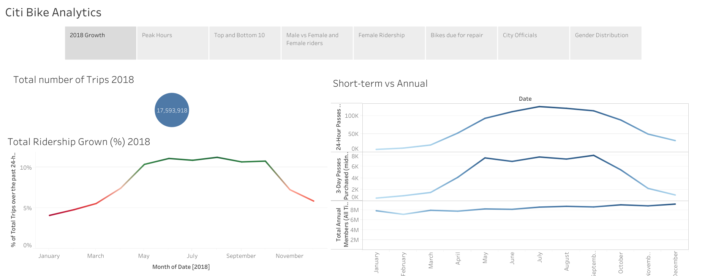
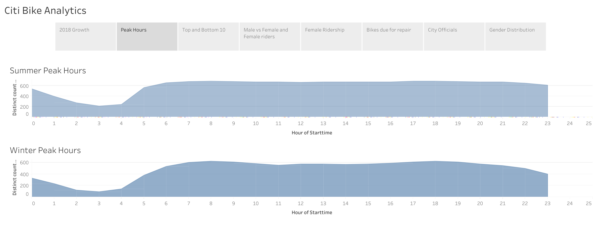
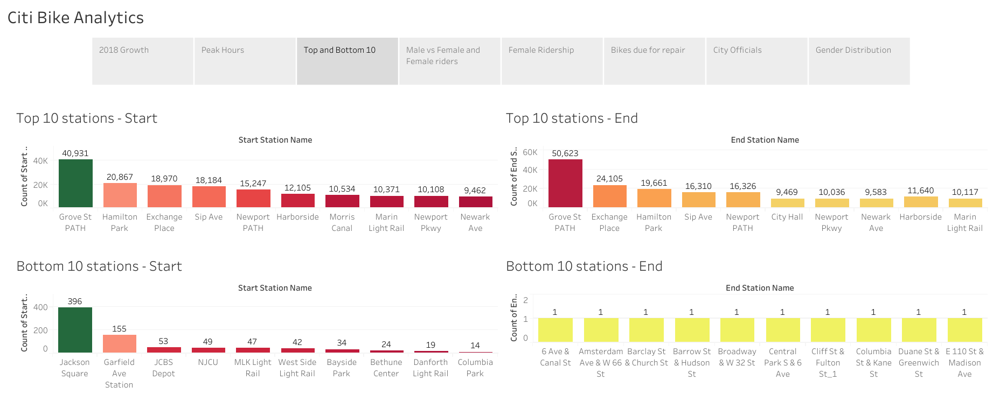
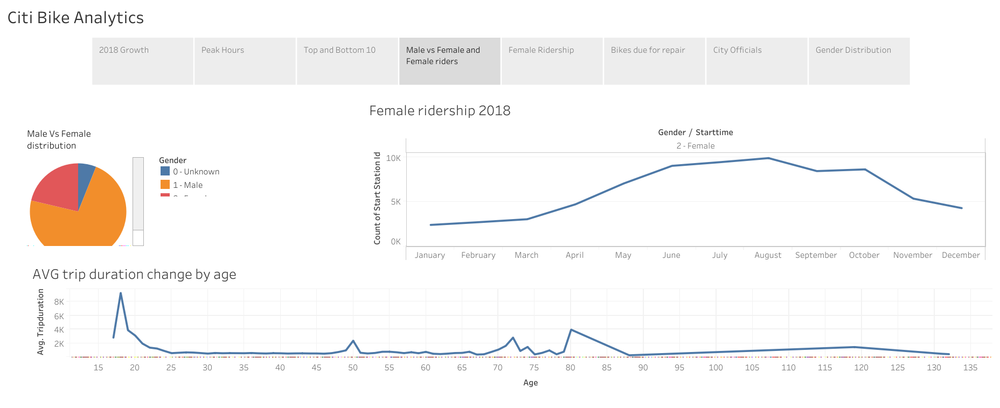
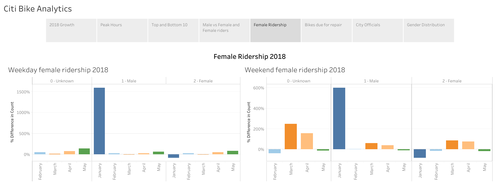
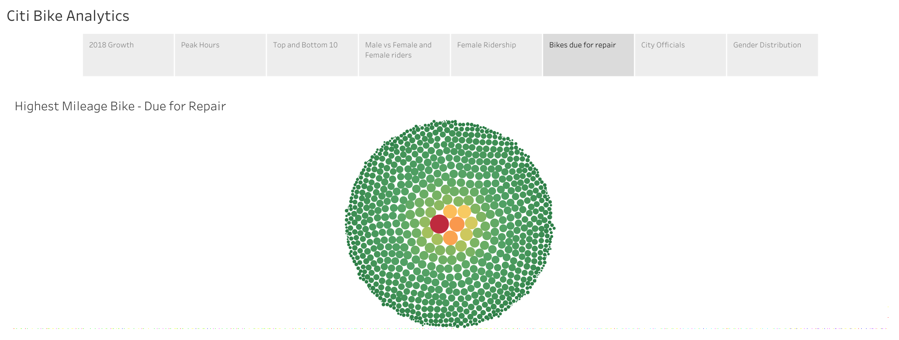
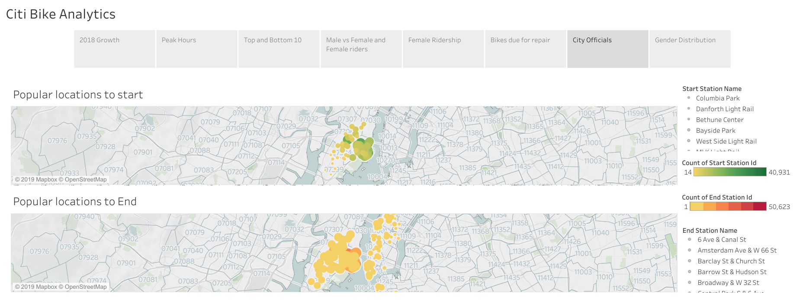
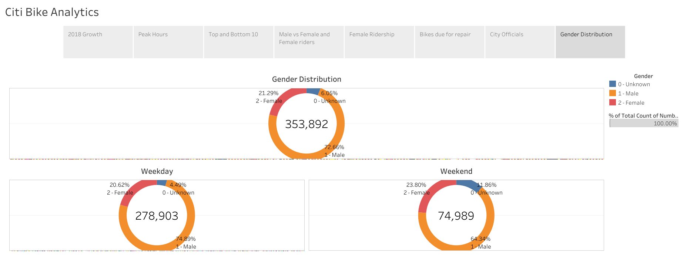

# Citi-Bike-Analytics

Since 2013, the Citi Bike Program has implemented a robust infrastructure for collecting data on the program's utilization. Each month bike data is collected, organized, and made public on the Citi Bike Data webpage.

Data Range: From January to December, 2018

Data Source: https://www.citibikenyc.com/system-data

(Used 'data_cleanup.ipynb' to combine large monthly datasets with trip history and quarterly datasets with membership data for 2018 into consolidated 2 csv files)

## Interactive Version of the Analysis

Final Tableau Story:

https://public.tableau.com/shared/Z6R3SX75C?:display_count=yes&:origin=viz_share_link

## Snapshots of the Tableau dashboards

Gokul@2019